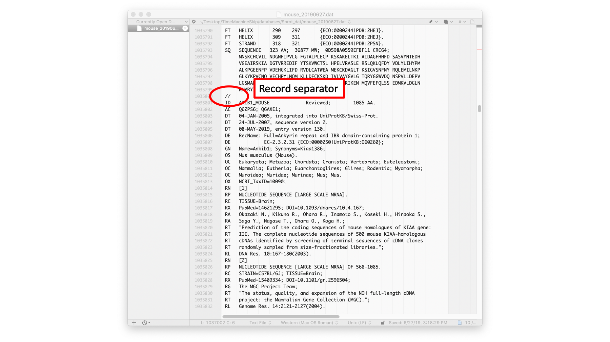
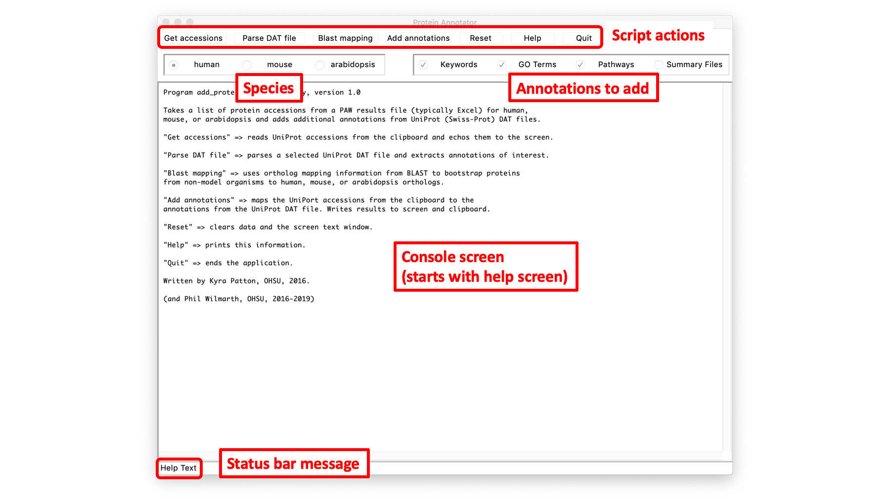
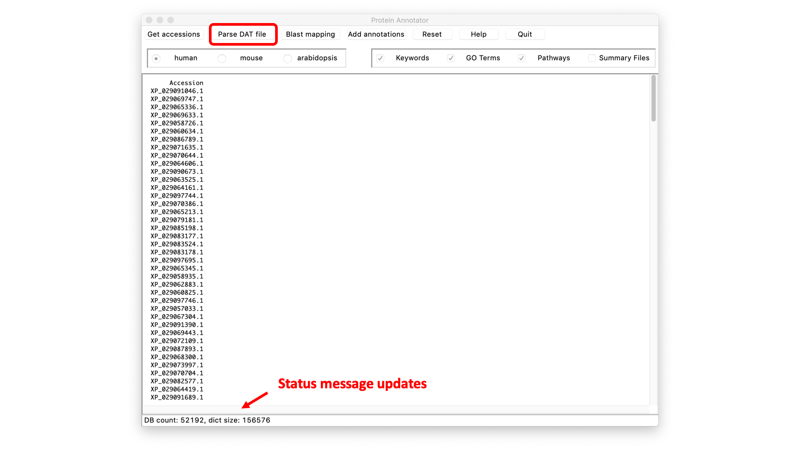
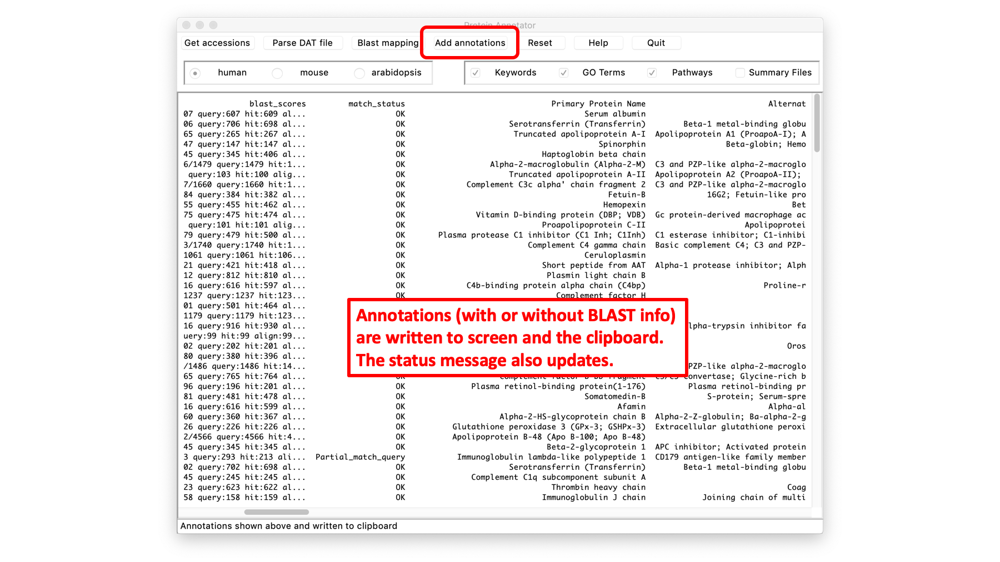

# add_uniprot_annotations

GUI Python script that adds rich UniProt annotations to proteomics results files.

---

## Bug Fixes!!! (20191018)

### Had some issues with both `add_uniprot_annotations.py` and `keywlist_download.py`

Apologies to all. I need to get more disciplined about testing. A few of my attempts to catch errors had errors. I am 99% sure most major things are working correctly. GUI applications are non-linear by nature and a bit harder to test and debug.

> If you encounter any issues, check to see if there is a newer version (check the commit dates). I tend to fix bugs as I encounter them and then update the repository. I do not have a formal release schedule for miscellaneous tools like these. If you still have any issues, you can email me ("wilmarth AT ohsu.edu" or "pwilmart AT me.com") or open an issue in the repository.

---

Written by **Kyra Patton**, OHSU summer research project, 2016

> The program requires a 3.X version of Python which can be obtained from www.python.org or from a scientific python distribution like [Anaconda](https://www.anaconda.com/distribution/). If you do the standard Python distribution, you will need to install [scientific Python extensions](https://scipy.org/install.html).

- keywlist_download.py - downloader script for key word list and DAT files
- add_uniprot_annotations.py - GUI script for adding annotations to results

## UniProt annotations

The Swiss-Prot manually annotated entries that you view at the [UniProt knowledgebase](https://www.uniprot.org) have most of their contents available in a flat text format ([DAT files](https://web.expasy.org/docs/userman.html)). This information can be retrieved, parsed, and added to proteomics results files, such as those from [the PAW pipeline](https://github.com/pwilmart/PAW_pipeline).

Part of a mouse DAT file (above). Descriptions of all of the fields and file format can be found in the main UniProt documentation:

There are some limitations to these annotation resources. The only UniProt proteins that are properly annotated are the manually curated entries (Reviewed sequences or Swiss-Prot entries). There are not many model systems that have relatively complete annotated proteomes. For practical purposes, this ends up being human, mouse, or arabidopsis (E. coli or yeast could probably also be included).

Individual UniProt DAT files can be downloaded via the REST API after restricting to human, mouse, or arabidopsis species, restricting to Reviewed sequences, and Downloading in Text format. The files are quite large, even in compressed format.

It is also possible to use the `keywlist_download.py` script to get the DAT records for all three species. The Swiss-Prot entries are relatively stable and updating the DAT file should only be needed a couple of time a year. The `keywlist_download.py` script downloads the entire UniProt Swiss-Prot DAT file (about 700MB compressed) from the FTP site, extracts the records for the three species, and also downloads the [UniProt keyword list](https://www.uniprot.org/keywords/).

Along the lines of the database organization schemes used by the [FASTA download scripts](https://github.com/pwilmart/fasta_utilities), a dedicated folder is recommended to keep copies of the DAT files. The download script will date stamp the DAT files.

---

## Ortholog mapping

Since there are limited annotated species, what do you do if your data is not from human, mouse, or arabidopsis? The short answer is to map your protein identifications to their human, mouse, or arabidopsis orthologs. There are some [PAW_BLAST scripts](https://github.com/pwilmart/PAW_BLAST) to help you do that.

The DAT files mentioned above can be used for many different sets of results, and that was why a centralized folder was recommended to help keep versions of the DAT files organized. The BLAST mapping files are project specific. They start with a **very** parsimonious list of identified proteins that is associated with a specific proteomics experiment. The full protein sequences for those identifications have to be gathered up in separate FASTA file. These result-specific FASTA files are compared to human, mouse, or arabidopsis canonical FASTA files (or Swiss-Prot files) using a local installation of the BLAST program. The XML results are parsed into a BLAST map table. These tables can be read by the `add_uniprot_annotations.py` script to add ortholog annotations to your results files. The most logical place to have the files from the BLAST mapping is in a specific project's folder.

---

## Example session

Dr. Ben Neely from the Marine Biochemical Sciences Group at [NIST Charleston](https://www.nist.gov/mml/hollings-marine-laboratory) shared some [narwhal](https://en.wikipedia.org/wiki/Narwhal) serum proteomics results from a [Mascot](http://www.matrixscience.com/) search. While narwhal has an NCBI RefSeq FASTA protein database available, its level of annotation may make investigating identified proteins more difficult. The [PAW_BLAST scripts](https://github.com/pwilmart/PAW_BLAST) were used to find the human orthologs. The `keywlist_download.py` script was run to download the necessary annotation files. There is a `2019-4-9_NW1_serum_F002042_cRAP-filtered.csv` file that was opened in Excel and saved as `2019-4-9_NW1_serum_F002042_cRAP-filtered.xlsx`. We will take the 275 identified proteins and get annotations for their human orthologs.  

The column of accessions for the 275 proteins was copied to a new tab for this exercise. Usually, the accession column will be one of several columns in the proteomics result table. We want the spreadsheet with the proteomics results open and available when we run the `add-uniprot_annotations.py` script. The script is designed as a helper script for Excel (or an equivalent table editor).

---

When the `add-uniprot_annotations.py` script is run, a tkinter GUI window will open. The script has a defined order of actions:

1. read accessions from the system clipboard
1. read annotations from a Swiss-Prot DAT file
1. [optionally] read in a BLAST mapping file
1. select annotation species
1. select annotation categories
1. select additional output summary files or not

The script puts its annotation results back onto the system clipboard so that they can be added to the Excel sheet.

---

We need to go back to the spreadsheet and select the column of accessions. The selected range should be just the accessions and [optionally] the header cell. Copy the selected cells to the clipboard. Split view can make selecting the cells in a long column easier.

---

Go back to the GUI window and click the `Get accessions` button. The accessions should appear in the main screen area and the status bar will tell you how many accessions were read. This is a good time to select the species that you want to get annotations for (or the species that you did the ortholog mapping to).
> **Note:** human and mouse have different sorts of annotations. Human is very well studied for disease-related questions. Mice can be experimented with, so there is information about development and other things for mice that we may not have for human. Arapidopsis is available for plant systems.

---

When you click the `Parse DAT file` button, you will get a file dialog box to select the downloaded DAT file that has the annotations. This can be a multi-species file or a single species file. The first time a DAT file is used, the parsing is slower. An intermediate file (a Python pickle file) is saved so that subsequent parsing will be faster.

---

After parsing, the main screen does not change. The status bar message will update to give some details on the parsed file.

---

If you are working with non-human, non-mouse, or non-arabidopsis organisms, there will need to be a BLAST mapping file to get mappings to one of the annotated species. Clicking on the `Blast mapping` button will open a file browser dialog box to locate the relevant BLAST mapping file. This will typically be in a specific project folder (not where the DAT file resides).

**Accessions need to be read from the clipboard before the BLAST mapping is read to create the mapping from the results accessions to the human/mouse/arabidopsis orthologs.**

---

The information from the BLAST map will be shown in the screen. For this example, we have the 275 identified proteins and some information about their human orthologs. The table is also written to the clipboard so that ortholog information can be used in other ways.

The next step will add the annotation information. The types of annotation information (keywords, GO terms, and/or pathways) that are desired should be checked. The `Summary Files` checkbox will create reports of annotations in any of the checked categories where the tables are organized by annotation term instead of by protein. A location where the reports will be written must be supplied in a dialog box before the annotations will be added. Examples of these files (`GOTerms_report.txt`, `keyword_report.txt`, and `pathway_report.txt`) are in the repository.

---

Clicking the `Add annotations` button will create a table of the original accessions and their associated annotations. If a BLAST map was used, there will be additional columns that have BLAST results. Mouse has extra [MGI database](http://www.informatics.jax.org/) information. The annotations are written to both the screen and the system clipboard.

---

To add the annotation information back to the proteomics results, you need to select a single cell in the header row that is to the right of any existing columns. Several new columns of data will be added when the results on the clipboard are **pasted** back into the sheet. An `Index` column is included in the results that should be the same as the initial accessions column. This allows for double checking that all of the rows in the annotations are still in sync with the proteomics results rows. Excel has some restrictions on paste operations. The sheet cannot have any hidden rows, for example. The script can be run again if Excel protests (after fixing the underlying issue). A little trial and error should make it clear about what state the spreadsheet needs to be in to get things to work.

---

After the annotation columns are added to one or more tabs (depending on your sheet layout), some sheet formatting may be in order. I like to have the header row in bold and I use column filters a lot. Resizing column widths so that information can be more easily read is often needed. Hyperlink columns can be formatted as hyperlinks, etc. Coloring cells can also be handy. The region of the sheet (above) shows the BLAST information.

---

This region of the sheet has some of the Swiss-Prot annotation information for the human orthologs. The spreadsheet in the repository has a `ReadMe` tab with descriptions of all of the annotation columns.

---

## UniProt keywords

An overlooked feature of the Swiss-Prot manual annotation process is the keywords. This is a controlled vocabulary of about 1200 terms:

The terms are added by the curators and they fall into 10 categories. These terms can be much easier to make sense of than the more extensive (and redundant) GO terms. Keywords in the 10 categories are in the annotation reports if the `Keywords` checkbox is selected.

---

-Phil Wilmarth, OHSU, October 2019.
